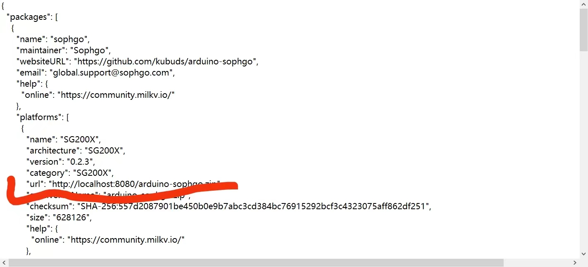
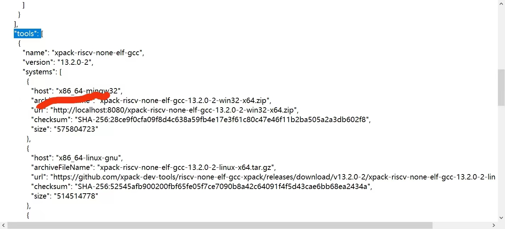

# 交付物说明

交付物包含如下内容：

- Arduino Duo支持代码

  - arduino-sophgo.zip: 包含了对Duo/Duo256的Arduino支持的源码

  - burntool.tar.gz/.zip: 包含了烧录工具python脚本

  - library.zip: 包含了适配过程中修改的第三方库，使用时可以放到arduino-sophgo源码的library目录

  - package_sg200x_index.json: 包含了Arduino IDE使用Duo支持的配置json文件

    在使用过程中，需要搭建一个html服务器，将arduino-sophgo.zip， burntool.tar.gz/.zip， package_sg200x_index.json 放到该服务器中，然后参考arduino-sophgo的README进行安装，注意需要将package_sg200x_index.json中"platforms"以及"tools"中的URL改成服务器的URL，如下图所示：
    
    改动需要符合IDE对应的架构，如在Windows上时，改动host为x86_64-mingw32的URL，如图所示：
    

- 大核修改代码
  - 0001-add-remoteproc-and-burn-support.patch:  包含了Duo小核加载运行Arduino程序针对Linux内核的修改，基于duo-buildroot-sdk commit 326b1882f2048acc31a150c21612b4168257e0d2生成
- 文档
  - 测试报告及程序: 包含了针对Duo的Arduino支持的相关测试说明
  - ArduinoDuo的接口及使用说明文档见arduino-sophgo的docs目录（后续可以生成html）

